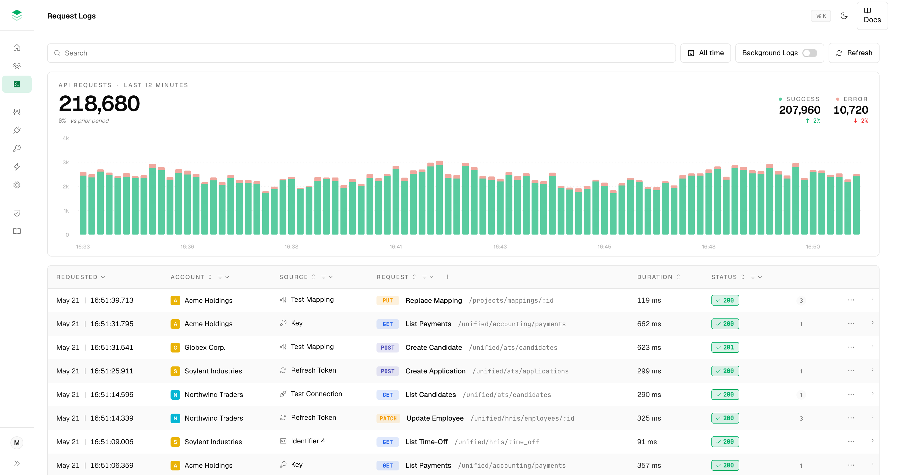
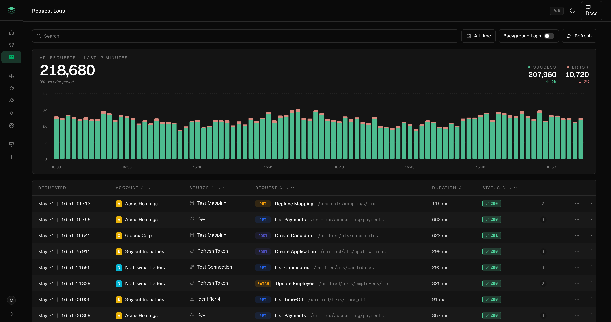

# StackOne Logs

An interview take on StackOne's **Request Logs** page: a recreation of the Figma flow, a written UX critique, a design pass on the improvements, and a working implementation.

> **Mission** · Help engineers find and fix integration failures fast. Every interaction in the Logs section accelerates the loop: *spot anomaly → drill into a request → understand why → take corrective action*. The **request** is the entity; everything else is a lens onto it.



---

## The headline improvement — Scope-to-Slice

The chart was the most underused surface in the original design: a passive widget sitting above the table with no functional connection to it. The headline improvement promotes it into the **primary investigation control**.

**Scope-to-Slice** is the interaction pattern:

- **Hover a bar** → the rows in that 12-second bucket get an accent stripe in the table. Hover a row → the matching bar lifts. Eyes never have to context-switch between the two surfaces.
- **Click a bar** → the table filters to that exact window, the URL captures the slice (`?from=…&to=…`), the chart redraws to that range. One click turns "I see a spike at 14:23" into "show me everything that happened then."
- **Clear the slice** with a single chip in the filter bar (or back-button — it's URL state).

This is the loop the brief asks for — *spot anomaly → drill in → understand* — collapsed into one gesture. Everything else (surfaced Replay, 4-tier status pills, soft chart palette) supports it. The chart is no longer decoration; it is the lens.

> A chart that filters the data beneath it is the difference between a dashboard and an investigation tool.

### Supporting improvements

- **URL-synced state** — every filter, the slice, the selected log, the active tab live in the URL. Refresh, back, and link-sharing all just work, and a chart slice becomes a shareable artifact.
- **Surfaced Replay on row hover** — the daily action moves from "two clicks behind a `…` menu" to one click on the row.
- **4-tier status pills with non-color signal** — 2xx ✓ / 3xx ⇄ / 4xx ⚠ / 5xx ✕. Client vs server failures distinguishable at a glance. WCAG 1.4.1.
- **⌘K command palette, vim-style shortcuts, installable PWA** — opt-in power-user surface for after the click-driven flow is internalised. Speed without taking anything away from discoverability.

---

## Quick start

```bash
pnpm install
pnpm dev           # http://localhost:5173/logs
pnpm build         # production build (+ service worker + manifest)
pnpm preview       # serve the production build locally
```

Requires Node 22+ and pnpm 11+. Or swap pnpm for npm / yarn — there's nothing pnpm-specific.

The mock data layer simulates 800–1200ms of network latency so skeleton states are visible during interaction.

---

## What's in the box

**Recreation of all 30 Figma frames** as a single working app: chart + filterable table + detail drawer, empty / loading / expanded states, Request/Response accordions, underlying-requests tab, expiry variants, and the full AI Error Explainer state machine (gated → collapsed → generating → generated → feedback → submitted).

**Improvements shipped on top** (see [docs/improvements.md](docs/improvements.md)) — detailed above:

1. **Scope-to-Slice** — chart ↔ table hover sync and click-to-filter as the primary investigation pattern
2. **URL-synced state** — every filter, slice, selected log, and active tab live in the URL
3. **Surfaced Replay** on row hover
4. **4-tier status pills** with non-color signal
5. **⌘K palette + shortcuts + PWA** — power-user surface layered on top

The Figma's frozen-timestamp pattern (every row showing `21:05:19.123`) is replaced by realistic varied timestamps from Faker — see [docs/critique.md § 1.1](docs/critique.md).



---

## Keyboard shortcuts

| Key | Action |
|---|---|
| `⌘K` / `Ctrl+K` | Toggle command palette |
| `/` | Focus the search input |
| `j` / `↓` · `k` / `↑` | Next / previous row |
| `Enter` | Open detail drawer for the selected row |
| `r` | Refresh chart + table |
| `Esc` | Close drawer, palette, popover |

Shortcuts suppress when focus is inside an `<input>` / `<textarea>` / contenteditable. Modifier matching is exact — `⌘K` won't trigger plain `k`.

---

<details>
<summary><strong>Stack and rationale</strong> — every dependency justified</summary>

Total: 13 runtime deps. Each chosen for a specific UX or a11y reason; nothing is template-default.

| Dependency | Why |
|---|---|
| **Vite + React 18 + TypeScript** | Fast dev. React 18 for `useSyncExternalStore` (theme manager, hover store). |
| **React Router 6** | URL-synced state via `useSearchParams`. |
| **Zustand** | 1KB cross-component hover handshake between chart and table. |
| **TanStack Table** | Headless table. Column visibility, sort, per-column filters, pagination — no styles. |
| **Visx** | Chart with `linearGradient`-filled bars (continuous error-on-success without seams), bidirectional hover via `useHoverStore`. |
| **@visx/responsive (ParentSize)** | Native-width chart rendering so x-axis tick labels don't get stretched. |
| **Radix UI primitives** | Dialog (drawer), DropdownMenu, Tabs, Tooltip, Switch, Popover, Accordion, Avatar, Toast. Headless, accessible, zero styles. |
| **react-day-picker** | Date range inside a Radix Popover. Hand-rolling a date picker is 200+ LOC of a11y traps. |
| **cmdk** | Headless ⌘K palette primitive. Wrapped in Radix Dialog for focus-trap + Esc behavior. |
| **@phosphor-icons/react** | Icons with weight variants — `weight="fill"` for active nav, `regular` elsewhere. State expression through a single icon family. |
| **vite-plugin-pwa** | Installable manifest + service worker. App shell precaches; mock data stays NetworkOnly. |
| **@faker-js/faker** *(dev)* | Realistic mock data. Fixed seed (42) so the dataset is deterministic. |
| **sharp** *(dev)* | One-shot PNG icon generation from the SVG source. |

**Deliberately avoided** — and why:

| | Why not |
|---|---|
| Tailwind / utility CSS | Project mandate: semantic CSS with role classes on primitives (`<button class="primary">`, not `.btn-primary`). |
| Framer Motion / any JS motion lib | All animations are CSS transitions on Radix `[data-state]` attrs. No JS in the motion path. |
| TanStack Query | Mock-only data layer. A ~40-LOC `useQuery` hook is enough until a real backend lands. |
| Recharts / Nivo / Tremor | Recharts has clunky `activeIndex` hover sync; Visx's render-prop API made bidirectional sync cleaner. |
| Sonner / shadcn | Both ship their own theme. Radix + own CSS stays stylable. |
| date-fns / dayjs / Moment | Native `Intl.RelativeTimeFormat` and `Intl.DateTimeFormat` cover every format we needed. |
| clsx / classnames | Role + data-attribute selectors do the work without class composition. |

</details>

<details>
<summary><strong>URL contract</strong></summary>

```
/logs?q=:string
     &status=:csv         # success | redirect | client-error | server-error
     &method=:csv         # GET,POST,PUT,PATCH,DELETE
     &account=:csv        # account names (deduplicated)
     &source=:csv         # source types
     &from=:isoDate
     &to=:isoDate
     &log=:logId
     &tab=details|underlying
     &state=empty         # demo-only: forces the empty list state
```

Every meaningful piece of UI state is in the URL. Reload restores context, back works, any view is shareable.

</details>

<details>
<summary><strong>File layout</strong></summary>

```
src/
├── App.tsx                       # Router shell, TooltipProvider
├── main.tsx                      # Entry, BrowserRouter
├── styles/                       # @layer reset, tokens, primitives, roles, patterns, layout, overrides
├── pages/Logs/
│   ├── index.tsx                 # Page composition + URL state wiring + keyboard shortcuts
│   ├── LogsChart.tsx             # Visx bars with gradient fills, hover sync, click-to-filter
│   ├── LogsTable.tsx             # TanStack Table — controlled column filters, pagination, row replay
│   ├── LogsFilters.tsx           # Search + date range + Background Logs toggle + Refresh
│   ├── LogsDetail.tsx            # Drawer with tabs, accordions, AI Error Explainer state machine
│   ├── LogsEmpty.tsx             # Empty / no-results states
│   └── LogsLoading.tsx           # ChartSkeleton + TableSkeleton with shimmer
├── components/
│   ├── primitives/               # Drawer, Switch, Tooltip (thin Radix wrappers)
│   ├── CommandPalette.tsx        # cmdk + Radix Dialog (modal={false} so it doesn't slide the drawer)
│   ├── ColumnFilterMenu.tsx      # Per-column filter dropdown
│   ├── RowActionsMenu.tsx        # Row "…" dropdown (Replay, Batch-Replay, etc.)
│   ├── Sidebar.tsx               # Collapsible nav with stub-link console warnings
│   ├── TopBar.tsx                # Page title + ⌘K hint + theme toggle + Docs link
│   ├── DateRangePicker.tsx       # react-day-picker in Radix Popover
│   ├── StatusPill.tsx            # 4-tier severity pill with icon + tooltip
│   ├── JsonViewer.tsx            # Recursive JSON tree (~80 LOC, no library)
│   └── …
├── data/
│   ├── mock.ts                   # Faker generators with seeded output
│   ├── service.ts                # Mock list/get/replay with 800-1200ms latency
│   └── useQuery.ts               # ~40 LOC query hook
├── state/
│   ├── urlState.ts               # useUrlState — typed wrapper over useSearchParams
│   ├── hoverStore.ts             # Zustand: bucket-hover + source ('bar' | 'row')
│   └── sidebarStore.ts           # Sidebar collapse persistence
└── lib/
    ├── theme.ts                  # Theme manager + useTheme (useSyncExternalStore)
    ├── time.ts                   # Intl wrappers
    ├── buckets.ts                # Timestamp ↔ bucket-index helpers
    └── keyboard.ts               # useKeyboardShortcut — exact modifier matching

docs/
├── critique.md                   # Phase B — 17-issue UX audit, anchored to Figma frames
├── improvements.md               # Phase C — design proposals for shipped items
├── audit.md                      # Per-frame Figma-vs-implementation discrepancy log
└── screenshots/                  # Final state captures
```

CSS uses cascade layers so specificity is predictable and new patterns slot in without fighting the cascade.

</details>

<details>
<summary><strong>Design decisions worth flagging</strong></summary>

**Color palette — softer chart, brand-faithful chrome.** The chart bars use mint `#59CCA0` + salmon `#F0A89E` instead of the brand `#00AF66` / `#EF3737`. Brand reds/greens are saved for status pills and alarm signals; chart bars carry traffic density and look calmer for it.

**Single-gradient bars, not stacked rects.** Two stacked rects with rounded corners produce a visible seam between segments. Each bucket renders as one `<rect>` with a `linearGradient` and a hard color stop at the error/success boundary — visually continuous, single hover region, simpler tooltip.

**Sidebar collapse is one-way.** Opening the detail drawer collapses the sidebar; closing it does *not* re-expand. Repeated row clicks would otherwise produce a jarring expand/collapse cycle.

**Bucket-mate highlight only fires from the chart side.** Hovering a row originally lit up every other row in the same 12s bucket — visually noisy. The hover store now tracks `hoverSource: 'bar' | 'row'`; row-hover only lifts the matching bar; bar-hover lights bucket-mates.

**Mocked data favours realism over fidelity.** The Figma's frozen `21:05:19.123` timestamp on every row would have been technically faithful but functionally misleading — see [critique 1.1](docs/critique.md). One log per visible chart bucket is seeded so click-filtering a bar always yields results.

**No JS-driven motion.** Drawer slide, accordion expand, toast spring, row pulse — all CSS transitions targeting Radix's `[data-state="open|closed"]` attributes. Smaller bundle, single motion language.

**Status pill is 4-tier.** 4xx and 5xx are categorically different problems for an integration engineer; the previous all-red treatment hid that. Amber-for-client-error, red-for-server-error is the operational signal.

Full critique and per-item design rationales: [docs/critique.md](docs/critique.md) · [docs/improvements.md](docs/improvements.md) · [docs/audit.md](docs/audit.md).

</details>

<details>
<summary><strong>Accessibility</strong></summary>

- **Keyboard reachable everything** — tab order is logical, focus rings via `:focus-visible` globally
- **Radix primitives** carry focus management (Dialog focus trap, DropdownMenu roving tabindex, Tooltip aria-describedby)
- **Status not color-only** — every status pill has an icon and a tooltip explaining the category
- **Chart has `role="img"` + `aria-label`** summarising the series; tooltip values are programmatic
- **Sidebar tooltips on collapse** keep labels accessible when icons are the only visual
- **`prefers-reduced-motion`** zeros out all animation/transition durations site-wide
- **Theme system** respects `prefers-color-scheme` by default, persists explicit user choice

</details>

<details>
<summary><strong>Out of scope</strong></summary>

Documented in [docs/critique.md](docs/critique.md) as "what we'd do next":

- Bulk row actions (multi-select Replay)
- Saved searches / recently viewed
- Realtime streaming updates instead of manual Refresh
- Two-tier drawer header for nested underlying-request views
- Sort state in URL (filter state is)
- Live unit tests / Playwright (manual verification is the bar for the assignment)

The bundle is ~370KB gzipped — fine for an internal tool, would code-split per route in a real app with more pages.

</details>

---

## License

Interview project — not licensed for redistribution.
